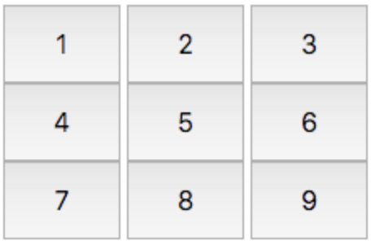
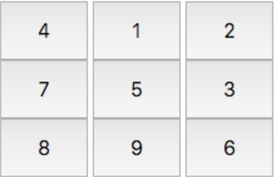
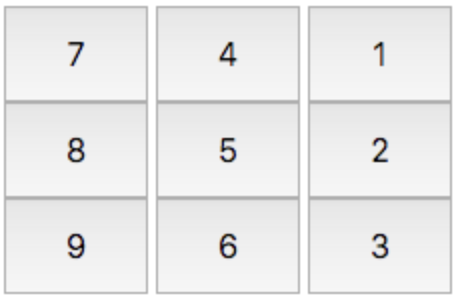

# Day 8

## Objective

In this challenge, we lay out buttons inside a `div` and modify their labels after each click event on one of the buttons. Check out the attached tutorial for learning materials.

## Task

We want to create nine buttons enclosed in a `div`, laid out so they form a grid. Each button has a distinct label from to , and the labels on the outer buttons must rotate in the clockwise direction each time we click the middle button.

Complete the code in the editor so that it satisfies the following criteria:

### Initial Layout (HTML)

Initial State. The initial layout looks like this:

### HMTL

Element IDs - each element in the document must have an id, specified below:

- the button container `div`'s id must be `btns`.
- the initial `innerHTML` labels must have the following button `id`s:

| `innerHTML` | `id`   |
| ----------- | ------ |
| `1`         | `btn1` |
| `2`         | `btn2` |
| `3`         | `btn3` |
| `4`         | `btn4` |
| `5`         | `btn5` |
| `6`         | `btn6` |
| `7`         | `btn7` |
| `8`         | `btn8` |
| `9`         | `btn9` |

### Styling

The document's elements must have the following styles:

- The `width` of `btns` is `75%`, relative to the document body's width.
- Each button (i.e., btn1 through btn9) satisfies the following:
  - The `width` is `30%`, relative to its container width.
  - The `height` is `48px`.
  - The `font-size` is `24px`.

### JavaScript

Behavior. Each time `btn5` is clicked, the `innerHTML` text on the grid's outer buttons (i.e., `bt1`, `btn2`, `btn3`, `btn4`, `btn6`, `btn7`, `btn8`,`btn9`) must rotate in the _clockwise_ direction. Do NOT update the button `id`'s.

After clicking `btn5` `1` time, they look like this:

After clicking `btn5` `1` more time (for a total of `2` clicks), they look like this:

