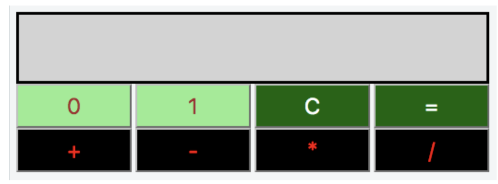
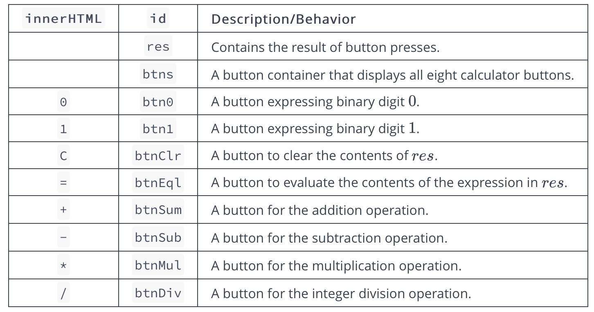

# Day 9: Binary Calculator

## Objective

In this challenge, we implement a calculator that uses binary numbers. Check out the attached tutorial for learning materials.

## Task

Implement a simple calculator that performs the following operations on binary numbers: addition, subtraction, multiplication, and division. Note that division operation must be integer division only; for example, `1001/100 = 10` , `1110/101 = 10`, and `101/1 = 101`.

**Initial State**: The calculator's initial state must look like this:



**Element IDs**: Each element in the document must have an id, specified below:



**Styling**: The document's elements must have the following styles:

- `body` has a `width` of `33%`
- `rs` has a `background-color` of `lightgray`, a `border` that is `solid`, a `height` of `48px` and a `font-size` of `20px`
- `btn0` and `btn1` have a `background-color` of `lightgreen` and a `color` of `brown`
- `btnClr` and `btnEql` have a `background-color` of `darkgreen` and a `color` of `white`.
- `btnSum`, `btnSub`, `btnMul` and `btnDiv` have a `background-color` of `black` and a `color` of `red`
- all the buttons in `btns` have a `width` of `25%`, a `height` of `36px`, a `font-size` of `18px`, `margin` of `0px` and a `float` value of `left`

The `.js` and `.css` files are in different directories, so use the link tag to provide the CSS file path and the script tag to provide the JS file path:

```html
<!DOCTYPE html>
<html>
  <head>
    <link rel="stylesheet" href="css/binaryCalculator.css" type="text/css" />
  </head>

  <body>
    <script src="js/binaryCalculator.js" type="text/javascript"></script>
  </body>
</html>
```

## Constraints

- All expressions in the test dataset are entered in the form `operand1 -> operator - operand2`, where `operand1` is the first binary number, `operand2` is the second binary number, and is in the set `{+, -, *, =}`.
- Both operands will always be positive integers when converted from base `-2` to base `-10`.
- All expressions will be valid.

## Explanation

Consider the following sequence of button clicks:

`1 => 1 => 0 => 1 `
